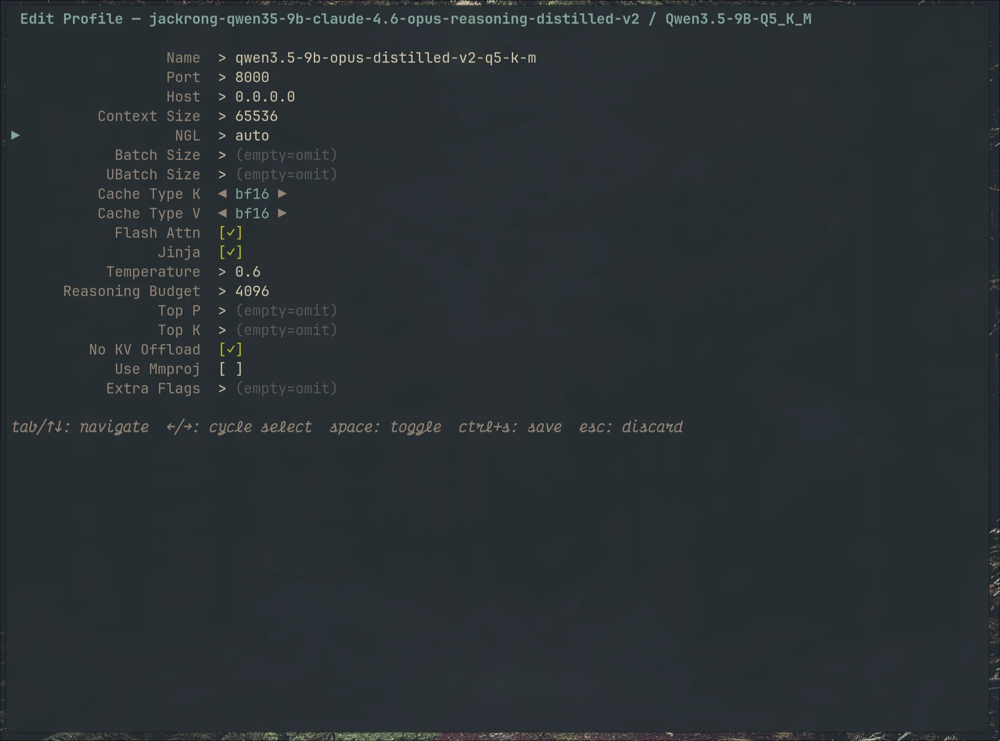
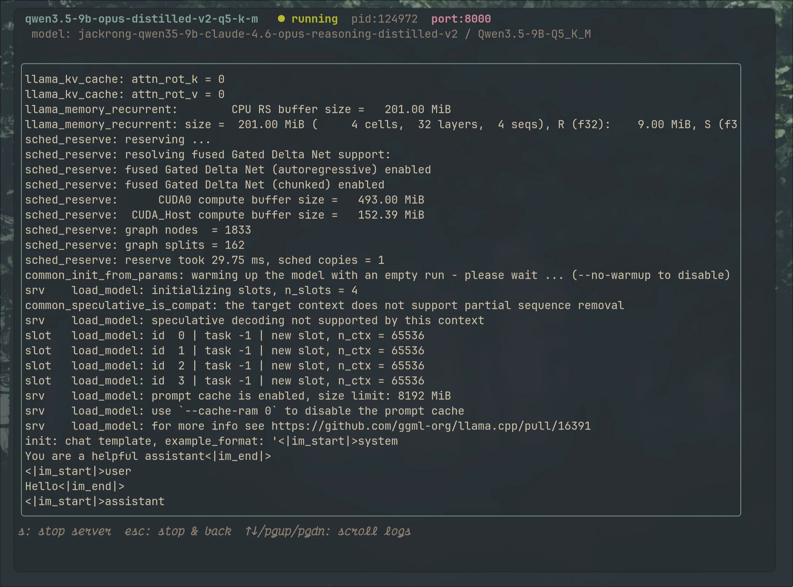

# infai

A terminal UI for managing [llama.cpp](https://github.com/ggerganov/llama.cpp) model profiles.  
Stop polluting your shell config with aliases — browse your GGUF models, store named launch profiles in SQLite, and run `llama-server` with live log streaming, all from one TUI.





## Features

- **Model browser** — auto-scans your models directory for `.gguf` files; detects `mmproj` vision projection files automatically
- **Named profiles** — store multiple launch configs per model (e.g. `text-only`, `with-image`, `low-vram`) in a local SQLite database
- **Smart fields** — cache type K/V use a `◀ bf16 ▶` picker instead of free-text; boolean flags are `[✓]` toggles
- **Live server logs** — llama-server runs as a child process inside the TUI with a scrollable log viewport; press `s` to stop
- **5 themes** — tokyonight, everforest, onedark, rosepine, gruvbox — press `t` to cycle, persisted across sessions

## Install

**Requires:** Go 1.23+, gcc (for `go-sqlite3` CGo)

```bash
go install github.com/dipankardas011/infai@latest
```

Or build from source:

```bash
git clone https://github.com/dipankardas011/infai
cd infai
go build -o infai .
```

## Configuration

On first run the tool creates a SQLite database at the OS config directory:

| OS      | Path |
|---------|------|
| Linux   | `~/.config/infai/config.db` |
| macOS   | `~/Library/Application Support/infai/config.db` |
| Windows | `%AppData%\infai\config.db` |

Two settings are seeded automatically and can be changed via a SQL client or by updating the `settings` table:

| Key          | Default |
|--------------|---------|
| `server_bin` | `/home/dipankardas/llama.cpp/build/bin/llama-server` |
| `theme`      | `tokyonight` |

Scan folders are stored in the `scan_dirs` table and managed from the TUI with `[e]`. On first run the legacy `models_dir` setting is migrated into `scan_dirs` automatically.

## Key bindings

### Model list
| Key | Action |
|-----|--------|
| `enter` | Select model |
| `e` | Explore / manage scan folders |
| `r` | Rescan all scan folders |
| `t` | Cycle theme |
| `/` | Filter |
| `q` / `ctrl+c` | Quit |

### Explore (scan folders)
| Key | Action |
|-----|--------|
| `a` | Add a new folder |
| `d` / `delete` | Remove selected folder |
| `↑` / `↓` | Navigate |
| `esc` | Save changes and go back (triggers rescan) |

### Profile list
| Key | Action |
|-----|--------|
| `enter` | Launch (or create new profile) |
| `e` | Edit profile |
| `d` | Delete profile (y/n confirm) |
| `esc` | Back to model list |

### Profile edit form
| Key | Action |
|-----|--------|
| `tab` / `↑↓` | Navigate fields |
| `←` / `→` | Cycle select options (cache type) |
| `space` | Toggle boolean fields |
| `ctrl+s` | Save |
| `esc` | Discard |

### Server log screen
| Key | Action |
|-----|--------|
| `s` | Stop server |
| `esc` | Stop server and go back |
| `↑↓` / `pgup` / `pgdn` | Scroll logs |

## Profile fields

| Field | Flag | Notes |
|-------|------|-------|
| Port | `--port` | |
| Host | `--host` | |
| Context Size | `-c` | |
| NGL | `-ngl` | GPU layers; `auto` or an integer |
| Batch Size | `-b` | Optional |
| UBatch Size | `-ub` | Optional |
| Cache Type K | `--cache-type-k` | f16 / bf16 / q8_0 / q4_0 … |
| Cache Type V | `--cache-type-v` | f16 / bf16 / q8_0 / q4_0 … |
| Flash Attn | `--flash-attn on` | Toggle |
| Jinja | `--jinja` | Toggle |
| Temperature | `--temperature` | Optional |
| Reasoning Budget | `--reasoning-budget` | Optional |
| Top P | `--top_p` | Optional |
| Top K | `--top_k` | Optional |
| No KV Offload | `--no-kv-offload` | Toggle |
| Use Mmproj | `--mmproj` | Toggle; only shown if model has an mmproj file |
| Extra Flags | appended verbatim | For anything not listed above |

## License

MIT
